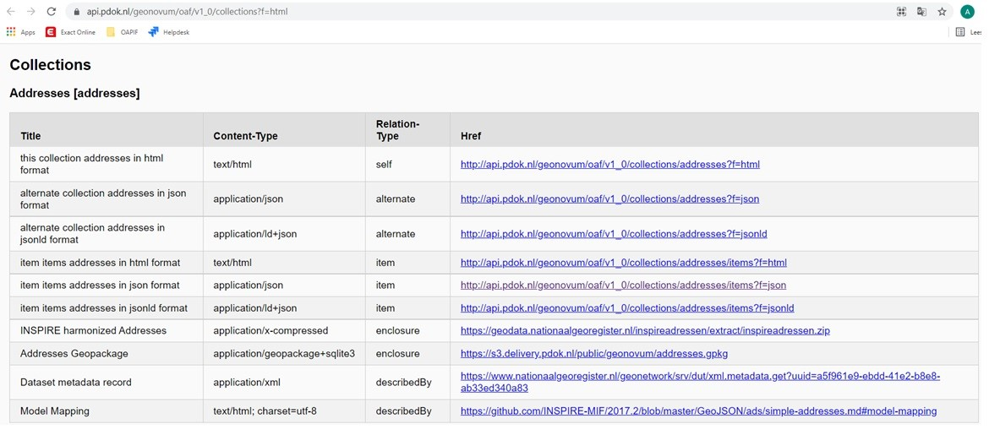

## Results

### Resulting findings

The following findings were encountered during the High5 session and are listed per requirement

#### Requirement 1 and 2: OGC API Features Core and INSPIRE-MIF document

These requirements are too general to mention findings.

#### Requirement 3:Multilinguality

Multilinguality is not a relevant issue for the Dutch situation, but might be of more interest to other countries.

#### Requirement 4:predefined download

Predefined download was not difficult to implement, because we easily referred to the existing Atom feed download services via https://api.pdok.nl/geonovum/oaf/v1_0/collections?f=html with
https://geodata.nationaalgeoregister.nl/inspireadressen/extract/inspireadressen.zip
https://s3.delivery.pdok.nl/public/geonovum/addresses.gpkg

#### Requirement 5:Geojson 

1. Much time is needed for the mapping to json. This was one of the reasons for using addresses, because for this theme, this work was already done: https://github.com/INSPIRE-MIF/2017.2/blob/master/GeoJSON/ads
2. We need a centralized establishment of json schema's for all the INSPIRE feature types, otherwise member states will all do this in their own way and we will never reach the goal of INSPIRE to be able to do cross boarder mapping.
3. We could consider leaving out the empty fields, or use an option not to show them

#### Requirement 6:bulk download 

The bulk download requirement, is considered the same as the one for predefined download.

#### Requirement 7:CRS ETRS89 and WGS84

Only coordinate reference system  [WGS84](https://epsg.io/4326) was implemented, because there was no time for another CRS. If time is available, [ETRS89](https://epsg.io/4258) should be considered first, because this is the one used within INSPIRE.
PDOK would do the transformation in advance and serve two datasets to improve the interoperability. The alternative, transforming on the fly, would probably not perform well.

#### Requirement 8:GML

1. GML as output is difficult and would not be realistic in the time available for this research. It was there for not implemented. One could also discuss if it is really useful, because it is not in line with the aim of OGI API Features: easy to use for developers.
2. Complex GML as input needs a flattening of the data. This is needed for the software that publishes the features. It can only work with simple features, with one value per attribute and without relations to other objects. This is often not the case with the more complex INSPIRE models.
3. PDOK prefers flattened data as input in geopackages, so the data prividers have to do this flattening by themself.
4. In the case of the Dutch addresses the choice has finally been made, not to use the harmonized GML as input, but the AS-Is-data, because in this harmonized GML file, the addresses don't contain the actual address, but links to sub elements via the components tag. As a result of this choice, the Inspire-ID is missing because that was no part of the AS-Is data.

#### Requirement 9:Dutch API design rules

[Dutch API designrules](https://www.geonovum.nl/over-geonovum/actueel/rest-api-design-rules-op-pas-toe-leg-uit-lijst) still have to be considered in relation to this project.

#### Requirement 10:describing encoding

The describing of the encoding was not difficult to implement, because we easily referred to it via https://api.pdok.nl/geonovum/oaf/v1_0/collections?f=html with:
https://github.com/INSPIRE-MIF/2017.2/blob/master/GeoJSON/ads/simple-addresses.md#model-mapping
	
#### Requirement 11:filtering

For implementing filters, the bbox and items options were implemented. A next step would be filtering on values of the attributes. 
For that it would be needed to get an overview of the attributes with https://api.pdok.nl/geonovum/oaf/v1_0/collections/addresses/queryables?f=html

#### Requirement 12:metadata links

1. Metadata link of the dataset was not difficult to implement, because we easily referred to it via https://api.pdok.nl/geonovum/oaf/v1_0/collections?f=html with:
https://www.nationaalgeoregister.nl/geonetwork/srv/dut/xml.metadata.get?uuid=a5f961e9-ebdd-41e2-b8e8-ab33ed340a83 . It still needs adjustment, for adding the OAPIF to the download links. A new protocol needs to be added to the codelist for this. (https://inspire.ec.europa.eu/metadata-codelist/ProtocolValue:1)
2. The metadata of the services were not implemented, but could be copied from the WFS metadata with some slight adjustments
3. Metadata of the service could also be obtained from: https://api.pdok.nl/geonovum/oaf/v1_0/api?f=html

#### Other findings

1. The HIGH5 session has given a lot of insight for PDOK for future implementations of INSPIRE OAPIF for their data providers
2. More technical findings and issues can be found [here](https://github.com/PDOK/goaf/issues).
3. The data provider (Kadaster) was happy with the overview the collection request gave
4. PDOK has mainly focussed on the OGC API Features Core part 1 [[PUB-1]]. A next step would be to focus on part 2 (CRS) [[PUB-5]] and 3 (filtering) [[PUB-6]]
5. Another blocking issue before implementation of the OAPIF for INSPIRE at PDOK is that descriptions of encodings are not yet available for most themes.

### Resulting services

The resulting OGC API Feature service can be found via the links listed below.

The root: 
https://api.pdok.nl/geonovum/oaf/v1_0/

The collections:
https://api.pdok.nl/geonovum/oaf/v1_0/collections?f=html

<figure id="Figuur_1">

<figcaption>Result from collection request.</figcaption>
</figure>

The items:
https://api.pdok.nl/geonovum/oaf/v1_0/collections/addresses/items?f=html

### Possible improvements
The following improvements could still be made after the high5 session:

1. implementation of ETRS89 as CRS
2. adding the INSPIRE ID
3. give a result for https://api.pdok.nl/geonovum/oaf/v1_0/collections/addresses/queryables?f=html
4. implement filters other than bbox and items
5. metadata of the service and link to the service in the metadata of the dataset
6. ..

### Resulting documentation

A presentation in Dutch on the first results of the High5 can be found here: https://github.com/Geonovum/OAPIF-PDOK-INSPIRE/tree/main/docs/2021-06-25-OAPIF-PDOK-INSPIRE-High5_0.2.pptx
